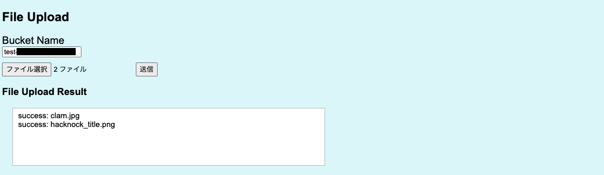

# clam.github.io

<!-- # Short Description -->

This repository hosts a demo website for clam that is a library to upload files to Cloud Storage or S3 only on front-end. The currently version only support to uplod files to Cloud Storage only.

<!-- # Badges -->

[](https://github.com/Hacknock/clam.github.io/issues)
[](https://github.com/Hacknock/clam.github.io/network/members)
[](https://github.com/Hacknock/clam.github.io/stargazers)
[](https://github.com/Hacknock/clam.github.io/)
[](https://github.com/Hacknock/clam.github.io/)

# Tags

`Cloud Storage` `Javascript` `front-end`

# Installation

You need to install Node.js if you use it on your local environment.
Additionally, Please run the following command on your terminal.

```
npm i
```

This command makes you install necessary environments to your PC.

# Deployment

Please run the following command if you deploy it on your local machine.

```
node server.js
```

# Minimal Example

Please access http://localhost:3000 after installation and deployment.

# How to Use

["How to upload files to Google Cloud Storage using Javascript on only the browser"](https://dev.to/akirakashihara/how-to-upload-files-to-google-cloud-storage-using-javascript-on-only-the-browser-11ei) might support you to use clam demo site.
Please refer to it.

## Get credential information from Google Cloud Console

You need Client ID, Redirect URL and Scope before using clam.
Please refer to ["How to get Google Client ID and Client Secret?"](https://www.balbooa.com/gridbox-documentation/how-to-get-google-client-id-and-client-secret) if you do not have any idea to get them.
Please set these information to each text field on [clam demo site](https://hacknock.github.io/clam.github.io/) after that.
If you success to set them, "SET" button color will be changed to "COMPLETE" button as you see the following.


## Get Access Token

You get an access token to upload files.
Please click "Get Access Token" button.
After authorization, your access token will be displayed on "Your Access Token" field as you see the following.


## File Upload

You can upload files after these process.
Please click "Brows..." button and select files you want to upload to your bucket on Cloud Storage.
You click "Submit Query" button, file uploading will start.
The result of file uploading will be displayed "File Upload Result" field.



# Contributors

- [KASHIHARAAkira](https://github.com/KASHIHARAAkira)

<!-- CREATED_BY_LEADYOU_README_GENERATOR -->
